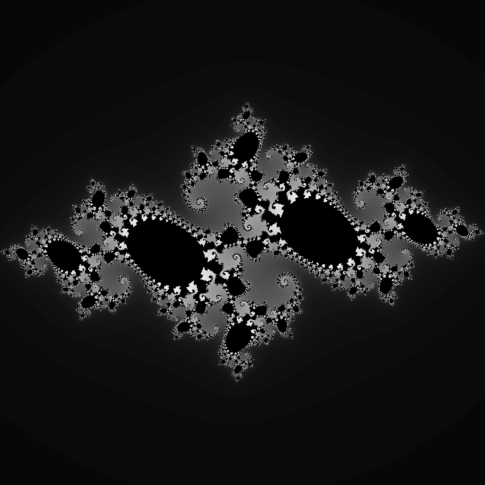

# julia.hoon

Produce a fractal from the Julia set on Urbit in Hoon.

The [Julia set]() is one of the most famous fractal generators.

This implementation is written in Hoon.  Save `julia.hoon` in your `gen/` directory of your desk.

    *%/julia/txt +julia 256

where `256` is the dimension you want.  Change the file extension from `txt` to `ppm` and load it using GIMP or another tool to visualize the output.

Play with changing `cx` and `cy`, the complex coordinates, and `maxiter` (currently at `100`).

**For dimensions larger than 999, you will need to edit the PPM file directly to normalize the numeric output from Hoon's 1.000 preference.**

PPM rendering routines borrowed and modified from Matt Newport's [raytracer](https://gist.github.com/mattnewport/f3eaa71c3f71cafe83da541cf3c052ae).
